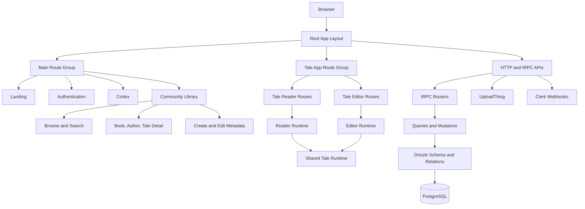
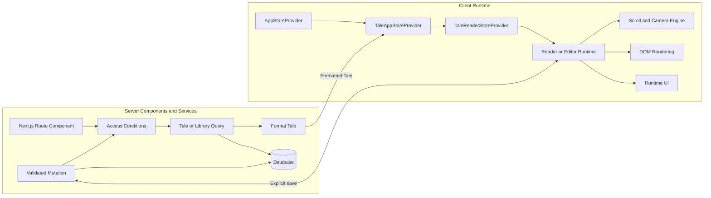
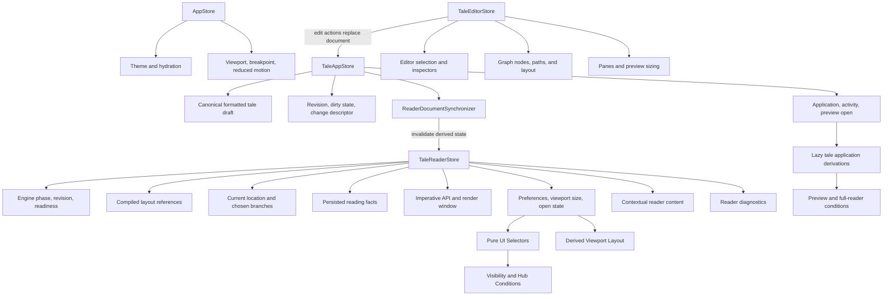
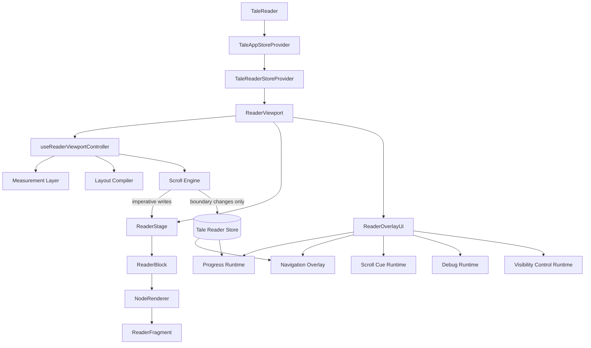
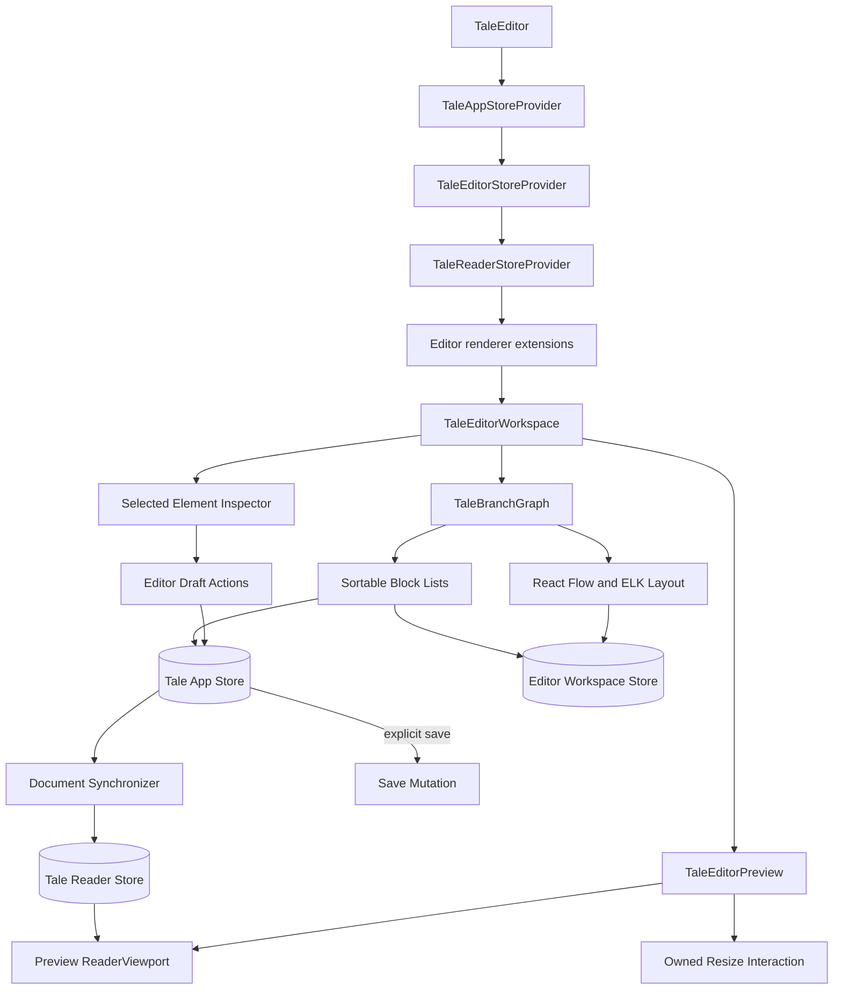
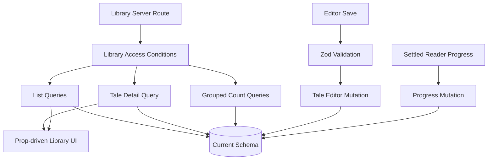

# Application Architecture

This document describes the current Talescape application boundaries and the
state ownership rules used when extending them.

## Application Domains

The `(main)` route group owns conventional site pages. The `(tale-app)` route
group owns the full-screen tale experience and its auto-hiding header. Reader
and editor routes are separate applications that reuse the same formatted tale,
rendering, compilation, and viewport infrastructure.

## Client and Server Boundaries

Database access remains server-only. Route components resolve authorization and
formatted tale data before mounting a client runtime. Editor changes are local
draft state until an explicit save mutation persists them.

## Tale Store Boundaries

Only independently mutable facts belong in a slice. Viewport dimensions are
canonical; portrait, landscape, and desktop layout labels are derived. UI
visibility mode is canonical; progress, navigation, and tool visibility are
pure derived concepts. Filtered collections and display labels stay outside the
store.

Store access follows these rules:

- Use a narrow selector for one primitive, action, or stable reference.
- Use one flat shallow selector when a coherent consumer needs several values.
- Keep named, reused domain derivations as pure selector functions.
- Do not create hooks that only conceal a one-use property selector.
- Do not move DOM elements, refs, or frame-by-frame camera values into Zustand.

## Reader Runtime

`ReaderOverlay` is structural composition. Feature runtime wrappers own their
visibility subscriptions and mount coherent UI groups. `ReaderProgress` remains
presentational and receives explicit display data.

The scroll engine owns per-frame work. Camera transforms, fragment animation,
visibility painting, and progress painting use refs, compiled metadata, and
direct DOM references. Zustand is updated at semantic boundaries rather than on
every animation frame.

## Editor Runtime

The preview owns its DOM resize handle and local refs. Preview width remains an
editor pane-layout preferences; preview visibility and reading/editing activity
belong to the shared tale application store. Graph selection is changed by
atomic editor actions so branch, block, and path selections cannot disagree.
Editor renderer extensions contain component implementations rather than editor
state; each overlay selects its own editor or document dependencies directly.

## Library and Persistence

Library data uses current schema concepts directly: branches, blocks,
fragments, paths, parts, entries, and pages. It does not fabricate legacy
sections. Library cards, lists, and detail panels are server-fed presentation
components and intentionally remain prop-driven.

## Shared Services

The important shared service boundaries are:

- `formatTale`: converts relational query results into the client tale model.
- reader compiler and geometry services: derive anchors, segments, indexes, and
  camera positions from formatted data and measured block sizes.
- scroll engine services: input normalization, navigation motion, visibility,
  animation evaluation, and persistence scheduling.
- library queries: authorization-aware lists, counts, and detail projections.
- tale editor mutations: validate and persist explicit editor drafts.
- reader progress mutations: persist debounced reader progress independently
  from per-frame rendering.

## Ownership Rules

- Route parameters, server-loaded records, refs, and render-instance DOM
  configuration remain owned by routes or components.
- Generic UI primitives and library presentation components remain prop-driven.
- Runtime-only reader/editor components may select their own store dependencies.
- Structural composition components do not route all child state through props.
- Shared selectors represent named domain concepts, not aliases for raw fields.
- Client state never substitutes for server authorization or schema validation.
